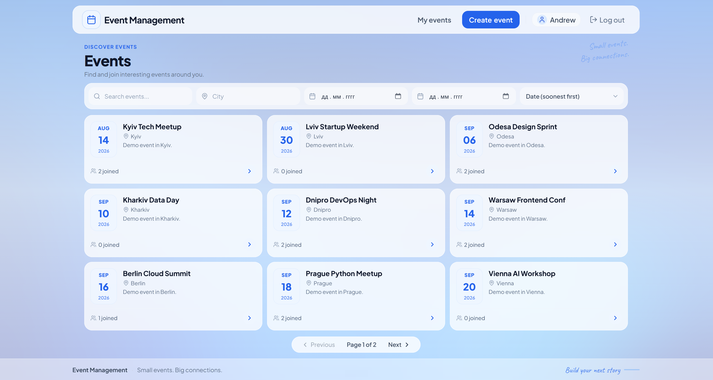

# Event Management Platform (React, TS, Django, DRF)

<p align="center">
  
</p>

## Live Demo

- **Live Application**: [https://event-management-bice-five.vercel.app/events](https://event-management-bice-five.vercel.app/events)
- **Interactive API Docs (Swagger UI)**: [https://event-backend-w942.onrender.com/api/docs/#/](https://event-backend-w942.onrender.com/api/docs/#/)
- **Backend API Service**: [https://event-backend-w942.onrender.com](https://event-backend-w942.onrender.com)

#### Demo Accounts
| Role | Email | Password |
| :--- | :--- | :--- |
| **Organizer / User** | `alice@demo.local` | `demo12345` |
| **Participant** | `bob@demo.local` | `demo12345` |

*(You can also sign up with any custom email and password directly through the UI).*

## Description

A modern, production-ready full-stack web platform for organizing events and managing attendee registrations. Built with a robust **Django REST Framework** backend, an asynchronous **Celery & Redis** processing pipeline, and a reactive **React + TypeScript + Tailwind CSS** frontend.

### Features

- **User Authentication & Security**:
  - Email/password authentication using custom User model (`email` as login credential).
  - Secure JWT authentication with Access and Refresh tokens stored in `HttpOnly`, `SameSite=Lax` cookies.
  - Full mitigation against XSS (no tokens in `localStorage`) and CSRF (`csrftoken` cookie + `X-CSRFToken` header validation).
  - Refresh token rotation and automatic blacklisting upon logout or rotation.
- **Event Management (CRUD)**:
  - Any authenticated user can create an event and automatically becomes its organizer.
  - Strict permissions: only the event organizer can edit (`PATCH`) or delete (`DELETE`) their event.
  - Future date validation: new events must be scheduled in the future.
- **Event Participation & Registration (Join / Leave)**:
  - Authenticated users can join and leave events with instant UI feedback.
  - Atomic double-registration guard guaranteed at the database level (`UniqueConstraint`).
  - Past event guard preventing registrations for events that have already elapsed.
  - Real-time participant counter (`participants_count`) and personal status indicator (`is_joined`).
- **Asynchronous Notifications**:
  - Joining an event triggers an asynchronous confirmation email sent via Celery and Redis.
  - Transaction-safe task scheduling via `transaction.on_commit` to prevent race conditions.
  - Automatic retry with exponential backoff on transient SMTP/network errors.
- **Search, Filtering & Pagination**:
  - Full-text search across event titles, descriptions, and locations.
  - Filtering by location (`icontains`), date ranges (`date_after`, `date_before`), organizer ID, and joined status (`joined=true`).
  - Configurable sorting (`date`, `created_at`, `title`) and pagination with customizable page size.
- **Modern Responsive Frontend**:
  - Built with Vite, React 18, TypeScript, and Tailwind CSS.
  - Server-state caching and synchronization with TanStack Query.
  - Type-safe form validation using React Hook Form and Zod.
  - Responsive layout with loading states, error boundaries, and empty state fallbacks.
- **Single-Origin Production Architecture**:
  - Zero-CORS setup: Nginx serves the compiled frontend assets and proxies `/api/`, `/admin/`, and `/static/` to the backend on the same origin.

---

## Key Features

### Technologies Used

#### Backend:
- **Python 3.12**
- **Django 5.x** (Custom User model, ORM, Admin portal)
- **Django REST Framework 3.16+** (Generic views, ViewSets, serializers, permissions, custom exception handler)
- **PostgreSQL 16** (Relational storage, native constraints, indexed search and dates)
- **djangorestframework-simplejwt** (+ `token_blacklist` for token rotation and revocation)
- **Celery 5.5+ & Redis 7** (Asynchronous background worker and message broker)
- **django-filter 25.1+** (Declarative query parameter filtering)
- **drf-spectacular 0.28+** (OpenAPI 3.1 schema generation, Swagger UI, ReDoc)
- **Gunicorn & WhiteNoise** (Production WSGI server and compressed static file handling)
- **Pytest, pytest-django, factory-boy** (Automated testing suite)
- **Ruff & MyPy** (Linting, code formatting, and static type analysis)

#### Frontend:
- **React 18**
- **TypeScript 5.6+**
- **Vite 5.4+** (Fast HMR development server and optimized production bundler)
- **TanStack Query v5** (Server state management, caching, and background refetching)
- **Axios** (HTTP client with automatic CSRF header injection and transparent 401 refresh interception)
- **React Router v6** (Client-side routing with authentication route guards)
- **React Hook Form & Zod** (Declarative form state and runtime schema validation)
- **Tailwind CSS 3.4+** (Utility-first styling system)

#### Infrastructure & DevOps:
- **Docker & Docker Compose** (Multi-stage builds, rootless container security via `gosu`, health checks)
- **Nginx 1.27** (Reverse proxy, single-origin static routing)

---

## Environment Variables

All configuration is managed through environment variables. Copy `.env.example` to `.env` before starting the application:

```bash
cp .env.example .env
```

### Configuration Parameters

| Variable | Default Value | Description |
| :--- | :--- | :--- |
| **Django Core** | | |
| `DEBUG` | `True` | Enables Django debug mode (set to `False` in production) |
| `SECRET_KEY` | *dev-only key* | Cryptographic signing key. Must be generated securely for production |
| `ALLOWED_HOSTS` | `localhost,127.0.0.1,backend` | Comma-separated list of host/domain names that this Django site can serve |
| `DJANGO_LOG_LEVEL` | `INFO` | Root and Django logger verbosity (`DEBUG`, `INFO`, `WARNING`, `ERROR`) |
| **Database (PostgreSQL)** | | |
| `POSTGRES_DB` | `event_management` | Name of the PostgreSQL database |
| `POSTGRES_USER` | `event_management` | PostgreSQL database user |
| `POSTGRES_PASSWORD` | *(empty in dev)* | PostgreSQL database password |
| `POSTGRES_HOST` | `postgres` | Database host (`postgres` for Docker network, `localhost` for local run) |
| `POSTGRES_PORT` | `5432` | Database port |
| `DATABASE_URL` | *(empty)* | Kept for specification compatibility (connection uses discrete `POSTGRES_*` variables) |
| **Redis & Celery** | | |
| `REDIS_URL` | `redis://redis:6379/0` | Connection URL for Redis message broker |
| **Security & JWT Cookies** | | |
| `COOKIE_SECURE` | `False` | Sets `Secure` flag on auth cookies (`True` in production for HTTPS) |
| `CSRF_TRUSTED_ORIGINS` | `http://localhost:3000` | Comma-separated origins permitted to pass Django's CSRF check |
| `CORS_ALLOWED_ORIGINS` | *(empty)* | Kept for specification compatibility (unused due to single-origin proxy) |
| `ACCESS_TOKEN_LIFETIME_MINUTES` | `10` | JWT Access Token lifetime in minutes |
| `REFRESH_TOKEN_LIFETIME_DAYS` | `7` | JWT Refresh Token lifetime in days |
| **Email (Notifications)** | | |
| `EMAIL_HOST` | *(empty)* | SMTP host. When empty, emails are logged directly to the Celery worker stdout |
| `EMAIL_PORT` | `587` | SMTP server port |
| `EMAIL_HOST_USER` | *(empty)* | SMTP username |
| `EMAIL_HOST_PASSWORD` | *(empty)* | SMTP password |
| **Demo Data** | | |
| `DEMO_USER_PASSWORD` | `demo12345` | Default password for seeded demo accounts (`alice@demo.local`, `bob@demo.local`) |
| **Frontend Environment (Docker)** | | |
| `VITE_BACKEND_URL` | `http://backend:8000` | Target URL used by Vite's development reverse proxy |

---

## Database

The relational database is PostgreSQL 16. It guarantees data integrity through unique constraints, foreign keys with cascade deletions, and B-tree indexes.

### Tables

#### 1. `users_user` (`User`)

Custom authentication user model using `email` as the unique login field while keeping `username` for public attribution.

| Field | Type | Constraints | Description |
| :--- | :--- | :--- | :--- |
| `id` | BIGINT | PRIMARY KEY, AUTO_INCREMENT | Unique user identifier |
| `email` | VARCHAR(254) | NOT NULL, UNIQUE | User email address (login credential) |
| `username` | VARCHAR(150) | NOT NULL, UNIQUE | Public username (displayed as event organizer) |
| `password` | VARCHAR(128) | NOT NULL | PBKDF2 hashed password |
| `first_name` | VARCHAR(150) | BLANK | User's first name |
| `last_name` | VARCHAR(150) | BLANK | User's last name |
| `is_active` | BOOLEAN | NOT NULL, DEFAULT TRUE | Status flag indicating active account |
| `is_staff` | BOOLEAN | NOT NULL, DEFAULT FALSE | Grants access to the Django Admin portal |
| `is_superuser` | BOOLEAN | NOT NULL, DEFAULT FALSE | Grants all permissions without explicit assignment |
| `date_joined` | TIMESTAMP WITH TZ | NOT NULL, DEFAULT NOW | Account registration timestamp |
| `last_login` | TIMESTAMP WITH TZ | NULLABLE | Timestamp of last successful login |

**Relationships:**
- One-to-Many with `events_event` via `organized_events` (a user can organize multiple events).
- One-to-Many with `registrations_eventregistration` via `registrations` (a user can join multiple events).

---

#### 2. `events_event` (`Event`)

Stores event details created by organizers.

| Field | Type | Constraints | Description |
| :--- | :--- | :--- | :--- |
| `id` | BIGINT | PRIMARY KEY, AUTO_INCREMENT | Unique event identifier |
| `title` | VARCHAR(200) | NOT NULL | Title of the event |
| `description` | TEXT | NOT NULL | Detailed description of the event |
| `date` | TIMESTAMP WITH TZ | NOT NULL, INDEXED | Scheduled date and time of the event |
| `location` | VARCHAR(200) | NOT NULL, INDEXED | Event venue or location |
| `organizer_id` | BIGINT | NOT NULL, REFERENCES `users_user(id)` ON DELETE CASCADE | Event organizer user ID |
| `created_at` | TIMESTAMP WITH TZ | NOT NULL, DEFAULT NOW | Creation timestamp |
| `updated_at` | TIMESTAMP WITH TZ | NOT NULL, AUTO UPDATE | Last update timestamp |

**Indexes & Constraints:**
- B-Tree index on `date` for fast time-range filtering and sorting.
- B-Tree index on `location` for rapid search and autocomplete.
- Default ordering: `["date", "id"]` ensuring deterministic pagination without shifting rows.

**Relationships:**
- Many-to-One with `users_user` (each event belongs to one organizer).
- One-to-Many with `registrations_eventregistration` via `registrations` (an event can have multiple attendees).

---

#### 3. `registrations_eventregistration` (`EventRegistration`)

Stores attendee participation for events.

| Field | Type | Constraints | Description |
| :--- | :--- | :--- | :--- |
| `id` | BIGINT | PRIMARY KEY, AUTO_INCREMENT | Unique registration identifier |
| `user_id` | BIGINT | NOT NULL, REFERENCES `users_user(id)` ON DELETE CASCADE | Participant user ID |
| `event_id` | BIGINT | NOT NULL, REFERENCES `events_event(id)` ON DELETE CASCADE | Target event ID |
| `created_at` | TIMESTAMP WITH TZ | NOT NULL, DEFAULT NOW | Timestamp when user joined the event |

**Constraints:**
- Composite `UniqueConstraint(fields=["user", "event"], name="uniq_user_event")` ensuring at the database level that a user cannot join the same event more than once.

**Relationships:**
- Many-to-One with `users_user` (each registration belongs to one user).
- Many-to-One with `events_event` (each registration belongs to one event).

---

#### 4. JWT Blacklist Tables (SimpleJWT)

- `token_blacklist_outstandingtoken`: Tracks issued refresh tokens and their expiration dates.
- `token_blacklist_blacklistedtoken`: Records invalidated refresh tokens upon user logout or refresh rotation.

---

### Database Architecture Notes

1. **Deterministic Pagination**: Ordered by `["date", "id"]` to prevent records from shifting across page boundaries when events share the same date.
2. **N+1 Query Prevention**: Querysets annotate `participants_count=Count("registrations")` and `is_joined=Exists(...)` while prefetching the organizer with `.select_related("organizer")`, maintaining $O(1)$ query count.
3. **Database-Level Atomicity**: Uniqueness of event registrations is guarded by a database `UniqueConstraint` rather than application-level checks, eliminating race conditions under concurrent requests.
4. **Referential Integrity**: Cascading deletes ensure that when an event or user is deleted, associated registrations are cleanly removed.

---

## API Endpoints

### Base URL

`/api/v1`

### Authentication & Security Architecture

Authentication uses JWT tokens stored in **`HttpOnly` cookies**:
- `access_token`: Short-lived (default 10 min), path `/api/`, `HttpOnly`, `SameSite=Lax`.
- `refresh_token`: Long-lived (default 7 days), path `/api/v1/auth/`, `HttpOnly`, `SameSite=Lax`.
- **CSRF Protection**: The frontend fetches `GET /api/v1/auth/csrf/` once before mutations to receive the `csrftoken` cookie, which is sent as the `X-CSRFToken` request header on all state-changing requests (`POST`, `PATCH`, `DELETE`).

### Response Format

Standard Django REST Framework responses:
- Success responses return JSON entities directly (or `204 No Content`).
- Paginated responses return standard DRF pagination:
  ```json
  {
    "count": 15,
    "next": "http://localhost:3000/api/v1/events/?page=2",
    "previous": null,
    "results": [...]
  }
  ```
- Error responses return DRF's standard format without unnecessary envelopes:
  ```json
  {
    "detail": "Descriptive error message."
  }
  ```
- Validation errors return field-level dictionaries:
  ```json
  {
    "email": ["A user with that email already exists."],
    "date": ["Event date must be in the future."]
  }
  ```

---

### Auth Module

#### 1. Sign Up (Register)

**Endpoint:**
`POST /api/v1/auth/signup/` *(Legacy alias: `POST /api/v1/auth/register/`)*

**Description:**
Registers a new user account. Does not set auth cookies; the user must log in.

**Request Body:**
```json
{
  "email": "user@example.com",
  "username": "johndoe",
  "password": "SecurePassword123"
}
```

**Responses:**

- **201 Created:**
  ```json
  {
    "id": 1,
    "email": "user@example.com",
    "username": "johndoe"
  }
  ```

- **400 Bad Request:**
  ```json
  {
    "email": ["A user with that email already exists."],
    "username": ["A user with that username already exists."]
  }
  ```

---

#### 2. Log In (Obtain Tokens)

**Endpoint:**
`POST /api/v1/auth/token/`

**Description:**
Authenticates a user with email and password. Sets `access_token` and `refresh_token` as `HttpOnly` cookies. Returns public user profile in the response body.

**Request Body:**
```json
{
  "email": "user@example.com",
  "password": "SecurePassword123"
}
```

**Responses:**

- **200 OK:**
  *(Sets `access_token` and `refresh_token` cookies)*
  ```json
  {
    "user": {
      "id": 1,
      "email": "user@example.com",
      "username": "johndoe"
    }
  }
  ```

- **401 Unauthorized:**
  ```json
  {
    "detail": "No active account found with the given credentials"
  }
  ```

---

#### 3. Refresh Access Token

**Endpoint:**
`POST /api/v1/auth/token/refresh/`

**Description:**
Generates a new access token and rotated refresh token using the existing `refresh_token` cookie. The old refresh token is blacklisted.

**Request:**
Requires valid `refresh_token` in cookies.

**Responses:**

- **200 OK:**
  *(Sets updated `access_token` and `refresh_token` cookies)*
  ```json
  {
    "detail": "Token refreshed."
  }
  ```

- **401 Unauthorized:**
  ```json
  {
    "detail": "Refresh cookie is missing."
  }
  ```
  *or*
  ```json
  {
    "detail": "Token is invalid or expired"
  }
  ```

---

#### 4. Log Out

**Endpoint:**
`POST /api/v1/auth/logout/`

**Description:**
Blacklists the refresh token and clears authentication cookies. Idempotent: returns 204 even if cookies were already cleared.

**Responses:**

- **204 No Content:**
  *(Clears `access_token` and `refresh_token` cookies)*

---

#### 5. Current User Profile

**Endpoint:**
`GET /api/v1/auth/me/`

**Description:**
Retrieves the authenticated user's profile. Requires valid `access_token` cookie.

**Responses:**

- **200 OK:**
  ```json
  {
    "id": 1,
    "email": "user@example.com",
    "username": "johndoe"
  }
  ```

- **401 Unauthorized:**
  ```json
  {
    "detail": "Authentication credentials were not provided."
  }
  ```

---

#### 6. Issue CSRF Cookie

**Endpoint:**
`GET /api/v1/auth/csrf/`

**Description:**
Issues a `csrftoken` cookie (readable by JavaScript) required for Django's CSRF check on subsequent `POST`, `PATCH`, and `DELETE` requests.

**Responses:**

- **204 No Content:**
  *(Sets `csrftoken` cookie)*

---

### Events Module

#### 1. List Events (Search & Filters)

**Endpoint:**
`GET /api/v1/events/`

**Description:**
Retrieves a paginated list of events with filtering, search, and ordering. Publicly accessible. Annotates `participants_count` and `is_joined` status if the user is authenticated.

**Query Parameters:**

| Parameter | Type | Description |
| :--- | :--- | :--- |
| `page` | integer | Page number (default: `1`) |
| `page_size` | integer | Items per page (default: `9`, max: `100`) |
| `search` | string | Search term matching `title`, `description`, or `location` |
| `location` | string | Case-insensitive substring filter for location |
| `date_after` | ISO 8601 | Events occurring on or after date/time (e.g. `2026-10-01T00:00:00Z`) |
| `date_before` | ISO 8601 | Events occurring on or before date/time |
| `organizer` | integer | Filter by organizer user ID |
| `joined` | boolean | Filter events the authenticated user has joined (`true`/`false`). Alias: `registered` |
| `ordering` | string | Sorting field (`date`, `-date`, `created_at`, `-created_at`, `title`, `-title`) |

**Responses:**

- **200 OK:**
  ```json
  {
    "count": 15,
    "next": "http://localhost:3000/api/v1/events/?page=2",
    "previous": null,
    "results": [
      {
        "id": 1,
        "title": "Django & React Summit 2026",
        "description": "Annual full-stack developer conference.",
        "date": "2026-10-15T10:00:00Z",
        "location": "Berlin, Germany",
        "organizer": {
          "id": 1,
          "username": "alice"
        },
        "participants_count": 42,
        "is_joined": true,
        "registrations_count": 42,
        "is_registered": true,
        "created_at": "2026-09-12T18:30:00Z",
        "updated_at": "2026-09-12T18:30:00Z"
      }
    ]
  }
  ```

---

#### 2. Create Event

**Endpoint:**
`POST /api/v1/events/`

**Description:**
Creates a new event. The authenticated user is automatically assigned as the organizer. The event date must be in the future. Requires authentication.

**Request Body:**
```json
{
  "title": "Cloud Architecture Workshop",
  "description": "Hands-on workshop about distributed architectures and microservices.",
  "date": "2026-11-20T14:00:00Z",
  "location": "London, UK"
}
```

**Responses:**

- **201 Created:**
  ```json
  {
    "id": 16,
    "title": "Cloud Architecture Workshop",
    "description": "Hands-on workshop about distributed architectures and microservices.",
    "date": "2026-11-20T14:00:00Z",
    "location": "London, UK",
    "organizer": {
      "id": 1,
      "username": "alice"
    },
    "participants_count": 0,
    "is_joined": false,
    "registrations_count": 0,
    "is_registered": false,
    "created_at": "2026-09-14T01:00:00Z",
    "updated_at": "2026-09-14T01:00:00Z"
  }
  ```

- **400 Bad Request:**
  ```json
  {
    "date": ["Event date must be in the future."]
  }
  ```

- **401 Unauthorized:**
  ```json
  {
    "detail": "Authentication credentials were not provided."
  }
  ```

---

#### 3. Retrieve Event by ID

**Endpoint:**
`GET /api/v1/events/:id/`

**Description:**
Retrieves full details of a specific event. Publicly accessible.

**Responses:**

- **200 OK:**
  ```json
  {
    "id": 1,
    "title": "Django & React Summit 2026",
    "description": "Annual full-stack developer conference.",
    "date": "2026-10-15T10:00:00Z",
    "location": "Berlin, Germany",
    "organizer": {
      "id": 1,
      "username": "alice"
    },
    "participants_count": 42,
    "is_joined": false,
    "registrations_count": 42,
    "is_registered": false,
    "created_at": "2026-09-12T18:30:00Z",
    "updated_at": "2026-09-12T18:30:00Z"
  }
  ```

- **404 Not Found:**
  ```json
  {
    "detail": "No Event matches the given query."
  }
  ```

---

#### 4. Update Event (Partial)

**Endpoint:**
`PATCH /api/v1/events/:id/`

**Description:**
Updates one or more fields of an event. Only the event's organizer can perform updates. Requires authentication.

**Request Body:**
```json
{
  "location": "Virtual / Online",
  "description": "Updated event description."
}
```

**Responses:**

- **200 OK:** Returns updated `Event` object.
- **400 Bad Request:** Validation error.
- **403 Forbidden:**
  ```json
  {
    "detail": "You do not have permission to perform this action."
  }
  ```
- **404 Not Found:**
  ```json
  {
    "detail": "No Event matches the given query."
  }
  ```

---

#### 5. Delete Event

**Endpoint:**
`DELETE /api/v1/events/:id/`

**Description:**
Deletes an event and cascades to all its registrations. Only the event's organizer can delete it. Requires authentication.

**Responses:**

- **204 No Content:** Successfully deleted.
- **403 Forbidden:** Requester is not the organizer.
- **404 Not Found:** Event not found.

---

### Registrations Module

#### 1. Join Event

**Endpoint:**
`POST /api/v1/events/:id/join/` *(Legacy alias: `POST /api/v1/events/:id/register/`)*

**Description:**
Registers the authenticated user for the event. Schedules an asynchronous confirmation email via Celery. Requires authentication.

**Responses:**

- **201 Created:**
  ```json
  {
    "id": 10,
    "event": 1,
    "user": 2,
    "created_at": "2026-09-14T01:15:00Z"
  }
  ```

- **400 Bad Request:**
  ```json
  {
    "detail": "This event has already taken place."
  }
  ```

- **401 Unauthorized:**
  ```json
  {
    "detail": "Authentication credentials were not provided."
  }
  ```

- **404 Not Found:**
  ```json
  {
    "detail": "No Event matches the given query."
  }
  ```

- **409 Conflict:**
  ```json
  {
    "detail": "You have already joined this event."
  }
  ```

---

#### 2. Leave Event

**Endpoint:**
`DELETE /api/v1/events/:id/leave/` *(or `POST /api/v1/events/:id/leave/`, Legacy alias: `DELETE /api/v1/events/:id/register/`)*

**Description:**
Cancels the authenticated user's registration for the event. Requires authentication.

**Responses:**

- **204 No Content:** Successfully left the event.
- **401 Unauthorized:** User not authenticated.
- **404 Not Found:**
  ```json
  {
    "detail": "You have not joined this event."
  }
  ```

---

### System & Documentation Endpoints

| Endpoint | Method | Auth | Description |
| :--- | :--- | :--- | :--- |
| `/api/health/` | GET | Public | Health check verifying database connection (`{"status": "ok"}`) |
| `/api/schema/` | GET | Public | OpenAPI 3.1 schema specification (JSON / YAML) |
| `/api/docs/` | GET | Public | Interactive Swagger UI API documentation |
| `/api/redoc/` | GET | Public | Clean ReDoc API documentation viewer |
| `/admin/` | GET | Staff / Admin | Django Administration portal |

---

## Running the App with Docker (Recommended)

Docker Compose provisions all 5 services: **PostgreSQL**, **Redis**, **Django Backend**, **Celery Worker**, and **Frontend (Nginx / Vite)**.

### 1. Initialize Environment Variables

```bash
# Create local environment configuration
cp .env.example .env
```

### 2. Build and Start Containers

```bash
# Build images and start services in the background
docker compose up -d --build
```

> **Note:** Upon backend container startup, `entrypoint.sh` automatically runs database migrations (`migrate`) and collects static files (`collectstatic`).
>
> 🌐 **Web App URL:** Open **[http://localhost:3000](http://localhost:3000)** in your browser once the containers are running.

### 3. Seed Demo Data

To populate the database with 2 demo users and 15 realistic events across multiple cities:

```bash
docker compose exec backend python manage.py seed_demo
```

**Pre-configured Demo Credentials:**
- **Users:** `alice@demo.local`, `bob@demo.local`
- **Password:** `demo12345` (configured via `DEMO_USER_PASSWORD` in `.env`)

### 4. Useful Docker Commands

```bash
# View live aggregated logs
docker compose logs -f

# View logs for Celery worker (observe email dispatch)
docker compose logs -f celery-worker

# Run migrations manually
docker compose exec backend python manage.py migrate

# Create an administrator account
docker compose exec backend python manage.py createsuperuser

# Stop all containers
docker compose down

# Stop and reset all volumes (database & redis reset)
docker compose down -v
```

---

## Running the App Locally (without Docker)

### Prerequisites
- **Python 3.12+**
- **Node.js 20+** & **npm**
- **PostgreSQL 16** running locally on port `5432`
- **Redis 7** running locally on port `6379`

---

### 1. Backend Setup

```bash
# Navigate to backend directory
cd backend

# Configure environment variables (Django reads .env from project root or backend dir):
cp ../.env.example ../.env
# Ensure your ../.env points to your local services:
# POSTGRES_HOST=localhost
# REDIS_URL=redis://localhost:6379/0

# Create and activate a virtual environment
python -m venv .venv
# On Linux/macOS:
source .venv/bin/activate
# On Windows (PowerShell):
.venv\Scripts\Activate.ps1

# Install dependencies (requirements-dev.txt includes core packages via -r requirements.txt)
pip install -r requirements-dev.txt

# Apply database migrations
python manage.py migrate

# Seed demo data (2 users, 15 events)
python manage.py seed_demo

# Start the Django development server (Port 8000)
python manage.py runserver 0.0.0.0:8000
```

### 2. Celery Worker (in a separate terminal)

```bash
cd backend
source .venv/bin/activate  # or .venv\Scripts\Activate.ps1

# On Linux / macOS:
celery -A config worker -l info

# On Windows (PowerShell / CMD — solo pool is required due to Windows process model):
celery -A config worker -l info -P solo
```

---

### 3. Frontend Setup

```bash
# Navigate to frontend directory
cd frontend

# Install dependencies
npm install

# Start Vite development server (Port 3000)
npm run dev
```

The Vite development server starts at `http://localhost:3000` with an automatic proxy forwarding `/api` requests to `http://localhost:8000`.

---

## Testing & Quality Assurance

### 1. Backend Automated Tests (Pytest)

The backend includes a comprehensive test suite (60+ tests) covering authentication flows, cookie handling, token rotation, CRUD operations, permissions, database constraints, race condition prevention, and Celery background tasks.

```bash
# Run tests inside Docker
docker compose exec backend pytest

# Run a specific test module
docker compose exec backend pytest apps/events/tests/test_create.py

# Run tests locally (falls back automatically to in-memory SQLite if PostgreSQL is absent)
pytest
```

### 2. Backend Linting & Formatting (Ruff)

```bash
# Run Ruff linting check
docker compose exec backend ruff check .

# Automatically apply safe lint fixes
docker compose exec backend ruff check --fix .
```

### 3. Frontend Verification

```bash
cd frontend

# TypeScript type check
npm run type-check

# Production build check
npm run build
```

---

## Architecture & Engineering Decisions

1. **HttpOnly Cookies for JWT Storage:**
   Storing JWT tokens in `localStorage` leaves applications vulnerable to credential theft through Cross-Site Scripting (XSS). In this project, tokens are stored exclusively in `HttpOnly`, `SameSite=Lax` cookies that JavaScript cannot access. CSRF protection is enforced via Django's double-submit cookie pattern (`X-CSRFToken`).

2. **Atomic Uniqueness Guard at the Database Layer:**
   Checking whether a user has already registered for an event in application code before creating a record is vulnerable to concurrency race conditions. This project enforces uniqueness at the database level with a `UniqueConstraint(fields=["user", "event"])`, guaranteeing atomicity under high-concurrency loads.

3. **Transaction-Safe Asynchronous Dispatch (`transaction.on_commit`):**
   When a user joins an event, the Celery confirmation email task is scheduled using `transaction.on_commit`. This guarantees that the background worker never attempts to process an event or user before the database transaction has committed, and completely prevents ghost emails if a transaction rolls back.

4. **Single-Origin Deployment (Zero CORS Overhead):**
   In production, Nginx acts as a unified reverse proxy serving the compiled React single-page application and proxying `/api/`, `/admin/`, and `/static/` requests to the Django backend. Because both frontend and backend share the exact same origin (`http://localhost:3000`), cross-origin headers (`CORS`) are unnecessary and cookie management is streamlined.

5. **N+1 Query Optimization:**
   The event listing and detail endpoints compute `participants_count` and the personal `is_joined` flag directly inside the database query using Django ORM annotations (`Count` and `Exists`) alongside `.select_related("organizer")`, maintaining $O(1)$ query complexity regardless of page size.

6. **Clean Architecture & Separation of Concerns:**
   Backend applications follow strict unidirectional dependencies: `registrations` $\rightarrow$ `events` $\rightarrow$ `users`. The `events` application contains pure event logic without coupling to registration workflows; registration endpoints and Celery tasks reside cleanly within the `registrations` application.

---

## Quick Access Links

After starting the stack, the services are accessible at:

| Service | URL |
| :--- | :--- |
| 🌐 **Web Application (Frontend)** | [http://localhost:3000](http://localhost:3000) |
| 📖 **API Documentation (Swagger UI)** | [http://localhost:3000/api/docs/](http://localhost:3000/api/docs/) |
| 📚 **API Documentation (ReDoc)** | [http://localhost:3000/api/redoc/](http://localhost:3000/api/redoc/) |
| 📄 **OpenAPI 3.1 Schema** | [http://localhost:3000/api/schema/](http://localhost:3000/api/schema/) |
| 🩺 **Health Check** | [http://localhost:3000/api/health/](http://localhost:3000/api/health/) |
| 🔧 **Django Admin Portal** | [http://localhost:3000/admin/](http://localhost:3000/admin/) |
| 🔌 **Direct Backend API (Debug)** | [http://localhost:8000/api/v1/events/](http://localhost:8000/api/v1/events/) |
